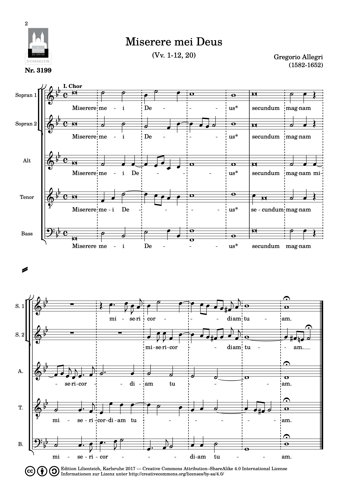

<!--
author: Dennis Ried
email: dennis.ried@musikwiss.uni-halle.de
version: 1.0.0
language: de
narrator: Deutsch Female
comment: Miserere mei, Allegri
import: https://gitlab.informatik.uni-halle.de/muwi/vl-mugesch-i/-/raw/main/config.md
        https://raw.githubusercontent.com/LiaTemplates/citations/main/README.md

link: ../style.css
-->

# Miserere mei, Allegri

* Gregorio Allegri
* \*1582 in Rom
* † 7. Februar (jul.) / 17. Februar 1652 (greg.) in Rom
* italienischer Priester, Komponist und Tenorsänger

 (Francesco Faraone Aquila - Bibliothèque nationale de France, Gemeinfrei, [https://commons.wikimedia.org/w/index.php?curid=186667](https://commons.wikimedia.org/w/index.php?curid=186667))

## Historischer Kontext: Rom im 17. Jahrhundert

### Kirchenmusikalische Entwicklung
* Konservative Haltung in Rom
* Weiterführung des Palestrinastils
* Entwicklungen:

  * Zunehmend homophoner Tonsatz
  * Steigerung der Stimmenzahl
  * Beispiel: Abbatini - Messen für bis zu 48 Stimmen
  * Aufführungspraxis: Sänger auf Gerüsten im Petersdom

* Bezeichnung: 'Römischer Prunkstil'

### Opernentwicklung in Rom
* Zwiespältige Haltung der Kirche
* Förderung durch Klerus und Kardinäle
* Besonderheiten:

  * Frauenverbot auf der Bühne (bis frühes 19. Jh.)
  * Übernahme der Frauenrollen durch Kastraten

* 1632: Theater der Kardinäle Barberini

  * Kapazität: 3000 Zuschauer
  * Prunkvolle Inszenierungen
  * Finanzierung durch Bischöfe und Kardinäle

## Allegris Miserere

### Entstehung und Aufführungspraxis
* Komponiert: 1637
* Besetzung: Neun Stimmen in zwei Chören
* Aufführungskontext:

  * Einmal jährlich am Karfreitag
  * Petersdom
  * Anwesenheit des Papstes
  * Aufführung durch päpstliche Kapelle

* Besonderheit: Verbreitungsverbot durch Kirche

### Musikalische Struktur
* Vertonung des 51. Psalms
* Aufführungsform:

  * Wechsel zwischen zwei Chören
  * Einstimmiger Priestergesang
  * Neunstimmiger Zusammenklang im letzten Vers

----

----

----

* Besondere Merkmale:

  * Einsatz von Kastraten
  * Improvisierte Verzierungen (Embellimenti)
  * Moderne Aufführungspraxis: Knabenstimmen (treble)

----

!?[Allegri | Miserere mei | King's College, Cambridge](https://www.youtube.com/watch?v=IX1zicNRLmY)

### Historische Rezeption

#### Mozart
* Erlebnis als Knabe in Rom
* Legendäre Nachschrift aus dem Gedächtnis
* Nachweis für seine Begabung

#### Charles Burney
* Erste Notenausgabe (Ende 18. Jh.)
* Trotz kirchlichen Verbots

#### Johann Friedrich Reichardt
* Deutscher Nachdruck
* Kritische Bemerkung:

  * Nimbus weniger durch musikalische Qualität
  * Bedeutung des Zeremoniells

#### Felix Mendelssohn Bartholdy (1831)
* Alter: 22 Jahre
* Dokumentation in Briefen an:

  * Eltern
  * Kompositionslehrer Carl Friedrich Zelter

* Beschreibung der Zeremonie:

  * Lange Bußgebete
  * Einstimmiger Psalmengesang
  * Löschen aller Kerzen
  * Kniefall von Papst und Klerus
  * Stummes Vaterunser
  * Miserere von der Kuppel

* Zitat: "[D]as thut ganz herrlich, und man fühlt recht innerlich die Gewalt der Musik, die ist es eigentlich, die die große Wirkung macht."
* Ebenfalls Niederschrift nach einmaligem Hören

#### Wilhelm Heinse
* Erlebnis 1782/83 in Rom
* Erwähnung im Roman "Hildegard von Hohenthal" (1795)
* Brief an Fritz Jacobi (16. März 1782):

  * Zitat: "Vorgestern hört ich [...] den Engelsgesang des Miserere zum erstenmal in der Sixtinischen Kapelle; das entzückendste was ein menschlich Wesen durchschauern kann, die reinste Harmonie, die [...] nach ewig frischer unsterblicher Existenz seufzt."

