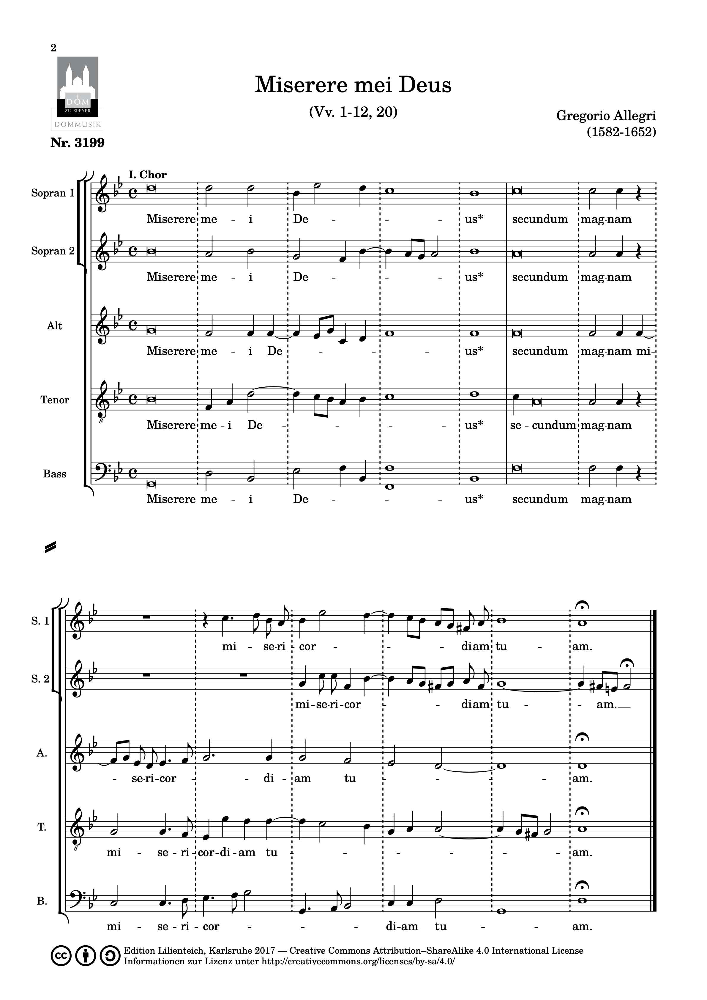
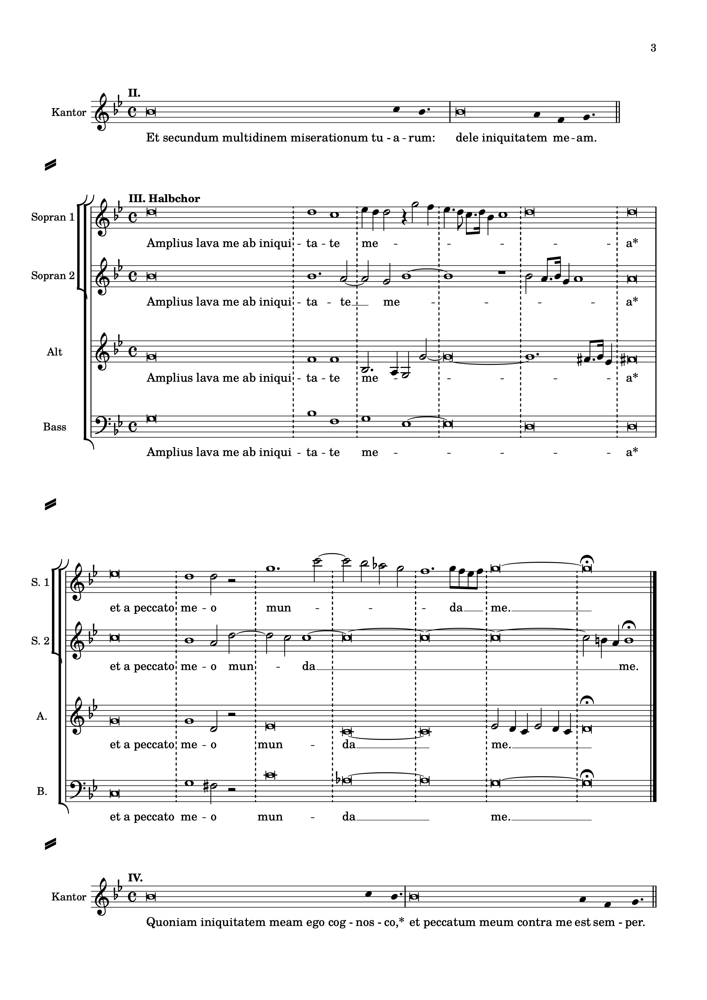

<!--
author:   Dennis Ried
email:    dennis.ried@musikwiss.uni-halle.de
version:  1.0.0
language: de
narrator: Deutsch Female
import:   ../config.md
link:     ../style.css
link:     https://fonts.googleapis.com/css2?family=Source+Sans+3:ital,wght@0,200..900;1,200..900&display=swap
font:     Source Sans 3
tags:     komponist, kultur, italien, rom, vokalmusik
-->

# Miserere mei von Allegri

* Gregorio Allegri
* \*1582 in Rom
* † 7. Februar (jul.) / 17. Februar 1652 (greg.) in Rom
* italienischer Priester, Komponist und Tenorsänger

(Francesco Faraone Aquila - Bibliothèque nationale de France, Gemeinfrei, [https://commons.wikimedia.org/w/index.php?curid=186667](https://commons.wikimedia.org/w/index.php?curid=186667))

## Historischer Kontext: Rom im 17. Jahrhundert

### Kirchenmusikalische Entwicklung
* Konservative Haltung in Rom
* Weiterführung des Palestrinastils
* Entwicklungen:

  * Zunehmend homophoner Tonsatz
  * Steigerung der Stimmenzahl
  * Beispiel: Abbatini – Messen für bis zu 48 Stimmen
  * Aufführungspraxis: Sänger auf Gerüsten im Petersdom

* Bezeichnung: ,Römischer Prunkstil‘

### Opernentwicklung in Rom

* Zwiespältige Haltung der Kirche
* Förderung durch Klerus und Kardinäle
* Besonderheiten:

  * Frauenverbot auf der Bühne (bis frühes 19. Jh.)
  * Übernahme der Frauenrollen durch Kastraten

* 1632: Theater der Kardinäle Barberini

  * Kapazität: 3000 Zuschauer
  * Prunkvolle Inszenierungen
  * Finanzierung durch Bischöfe und Kardinäle

## Allegris Miserere

### Entstehung und Aufführungspraxis
* Komponiert: 1637
* Besetzung: Neun Stimmen in zwei Chören
* Aufführungskontext:

  * *Einmal* jährlich am Karfreitag
  * Petersdom
  * Anwesenheit des Papstes
  * Aufführung durch päpstliche Kapelle

* Besonderheit: Verbreitungsverbot durch Kirche

### Musikalische Struktur
* Vertonung des [51. Psalms](https://www.die-bibel.de/bibel/VUL/PSA.50)
  
  -> [Psalmi iuxta Hebr. 50](www.die-bibel.de/bibel/VUL/PSA.50) in der *Biblia Sacra Vulgata*[^info]

* Aufführungsform:

  * Wechsel zwischen zwei Chören
  * Einstimmiger Priestergesang
  * Neunstimmiger Zusammenklang im letzten Vers

----

----

* Besondere Merkmale:

  * Einsatz von Kastraten
  * Improvisierte Verzierungen (Embellimenti)
  * Moderne Aufführungspraxis: Knabenstimmen (treble)

----

!?[Allegri | Miserere mei | King's College, Cambridge](https://www.youtube.com/watch?v=IX1zicNRLmY)

[^info]: *Psalmi iuxta Hebraicum translati* = "Psalmen übersetzt nach dem Hebräischen".
  
  Die Vulgata ist eine [lateinische Bibel](https://www.lateinlex.de/?call=Puc&permalink=Vulg). Das lateinische Wort *"vulgatus"* bedeutet "alltäglich"/"gemein"/"öffentlich" im Sinne von "volkstümlich"/"im Volk bekannt".

### Historische Rezeption

* Wolfgang Amadé Mozart
  
  * Erlebnis als Knabe in Rom
  * Legendäre Nachschrift aus dem Gedächtnis
  * Nachweis für seine Begabung

* Charles Burney
  
  * Erste Notenausgabe (Ende 18. Jh.)
  * Trotz kirchlichen Verbots

* Johann Friedrich Reichardt

  * Deutscher Nachdruck
  * Kritische Bemerkung:

    * Nimbus weniger durch musikalische Qualität
    * Bedeutung des Zeremoniells

* Felix Mendelssohn Bartholdy (1831)
  
  * Alter: 22 Jahre
  * Dokumentation in Briefen an:

    * Eltern
    * Kompositionslehrer Carl Friedrich Zelter

  * Beschreibung der Zeremonie:

    * Lange Bußgebete
    * Einstimmiger Psalmengesang
    * Löschen aller Kerzen
    * Kniefall von Papst und Klerus
    * Stummes Vaterunser
    * Miserere von der Kuppel

  * > [D]as thut ganz herrlich, und man fühlt recht innerlich die Gewalt der Musik, die ist es eigentlich, die die große Wirkung macht.
    >
    > – Felix Mendelssohn Bartholdy
  
  * Ebenfalls Niederschrift nach einmaligem Hören

* Wilhelm Heinse
  
  * Erlebnis 1782/83 in Rom
  * Erwähnung im Roman "Hildegard von Hohenthal" (1795)
  * Brief an Fritz Jacobi (16. März 1782):

  > Vorgestern hört ich \[...\] den Engelsgesang des Miserere zum erstenmal in der Sixtinischen Kapelle; das entzückendste was ein menschlich Wesen durchschauern kann, die reinste Harmonie, die \[...\] nach ewig frischer unsterblicher Existenz seufzt.
  >
  > – Wilhelm Heinse

## Quiz und Reflexion
Zeit sich zu erinnern! Hier sind drei Wissensfragen (Multiple-Choice, 1–3 Antworten sind jeweils richtig) und eine Verständnisfrage. Solche Fragen sollten nun beantworten werden können.

**Welche besonderen Umstände prägten die Aufführung von Allegris Miserere?**

[[X]] Aufführung nur einmal jährlich am Karfreitag im Petersdom
[[ ]] Täglich gesungenes Werk in allen römischen Kirchen
[[X]] Verbreitungsverbot durch die Kirche
[[X]] Anwesenheit des Papstes bei der Aufführung

**Was kennzeichnet den 'Römischen Prunkstil' des 17. Jahrhunderts?**

[[X]] Weiterführung des Palestrinastils mit konservativer Haltung
[[ ]] Vollständige Übernahme der neuen Monodie aus Florenz
[[X]] Steigerung der Stimmenzahl (bis zu 48 Stimmen)
[[X]] Zunehmend homophoner Tonsatz

**Welche Persönlichkeiten sind mit der Rezeption von Allegris Miserere verbunden?**

[[X]] Wolfgang Amadé Mozart - legendäre Nachschrift aus dem Gedächtnis als Knabe
[[X]] Felix Mendelssohn Bartholdy - Dokumentation der Zeremonie in Briefen (1831)
[[ ]] Johann Sebastian Bach - Bearbeitung für protestantischen Gottesdienst
[[X]] Charles Burney - erste Notenausgabe trotz kirchlichen Verbots

**Was sind charakteristische Merkmale der römischen Opernentwicklung im 17. Jahrhundert?**

[[ ]] Führende Rolle von Frauen als Sängerinnen auf der Bühne
[[X]] Frauenverbot auf der Bühne bis ins frühe 19. Jahrhundert
[[X]] Übernahme der Frauenrollen durch Kastraten
[[X]] Förderung durch Klerus und Kardinäle trotz zwiespältiger Kirchenhaltung

**Skizzieren Sie wie die Musikkultur in Rom durch Bischöfe und Kardinäle gefördert wurde und gehen Sie dabei auf die bilaterale Haltung des Klerus ein (Römischer Prunkstil vs. Monodie/Oper).**

*Sie sollten diese Aufgabe mit einem zusammenhängenden Text von ca. 1 Seite beantworten können*

## Übersichten

Alles auf einen Blick.

* **Literatur**

  * Keine spezifischen Literaturangaben genannt

* **Personen**

  * Abbatini, Antonio Maria (1595–1679?) – Komponist von Messen für bis zu 48 Stimmen
  * Allegri, Gregorio (1582–1652) – italienischer Priester, Komponist und Tenorsänger
  * Burney, Charles (1726–1814) – erste Notenausgabe des Miserere (Allegri) Ende des 18. Jh.
  * Heinse, (Johann Jakob) Wilhelm (1746–1803) – Erlebnis 1782/83 in Rom
  * Mendelssohn Bartholdy, Felix (1809–1847) – Dokumentation der Zeremonie in Briefen (1831)
  * Mozart, Wolfgang Amadé (1756–1791) – legendäre Nachschrift aus dem Gedächtnis als Knabe
  * Reichardt, Johann Friedrich (1752–1814) – deutscher Nachdruck
  * Zelter, Carl Friedrich (1758–1832) – Kompositionslehrer Mendelssohns

* **Werke**
  
  * Allegri, Gregorio: Miserere mei (1637) – Vertonung des 51. Psalms für neun Stimmen in zwei Chören

    * [Aufnahme des Ensembles Voces8](https://youtu.be/cLtm0DqNPHM?si=6eb58ig3y8IQuIM5)

