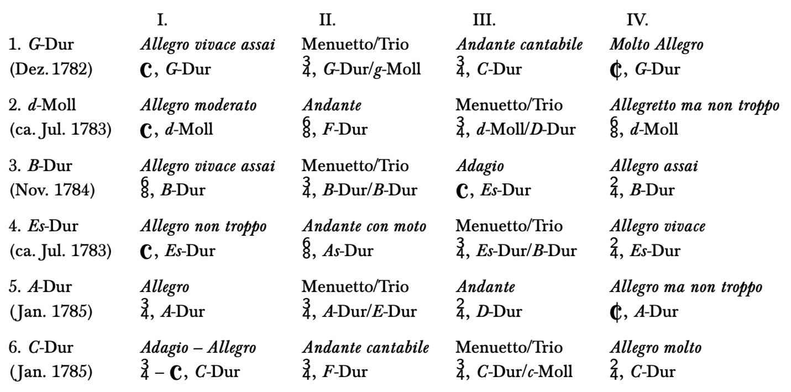
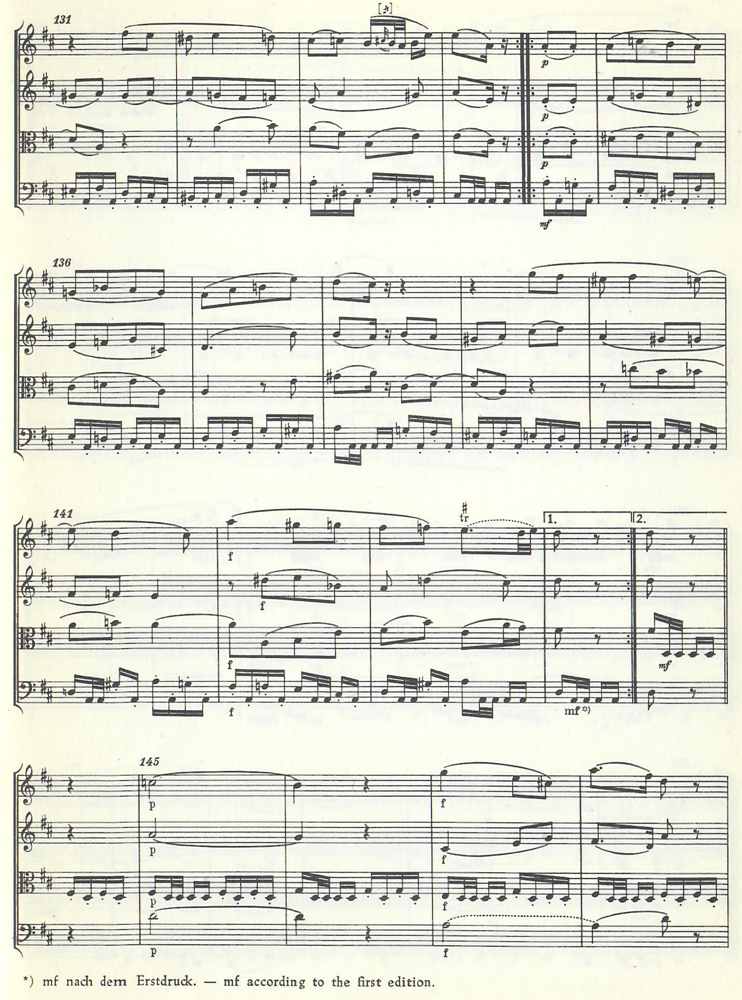
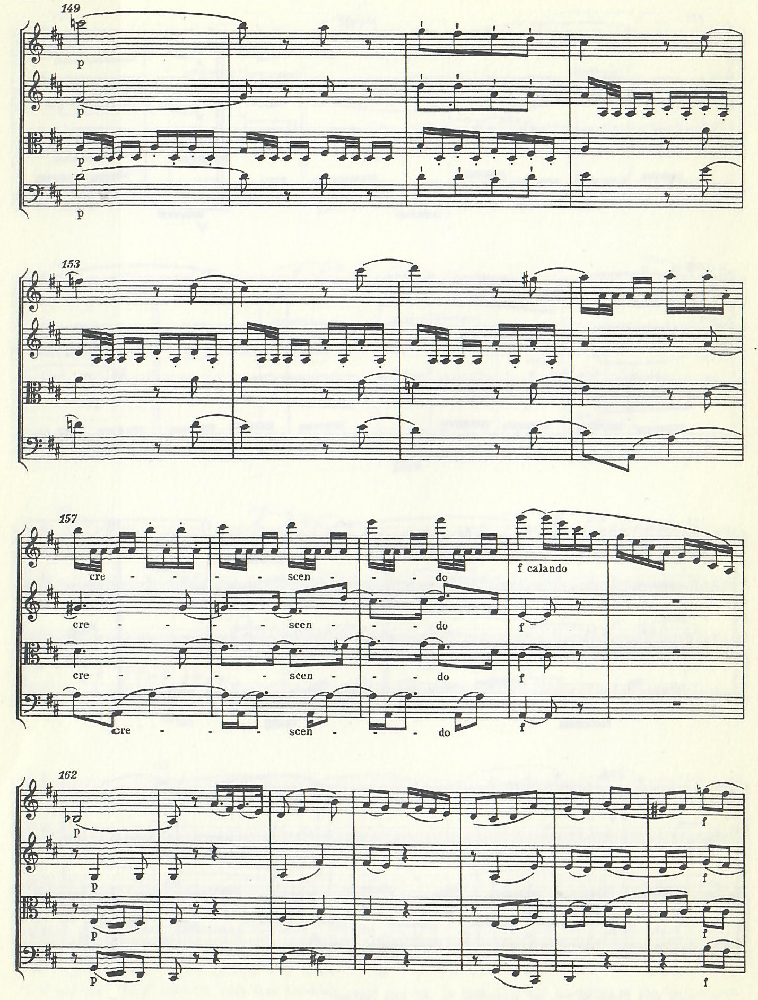

<!--
author:   Dennis Ried
email:    dennis.ried@musikwiss.uni-halle.de
version:  1.0.0
language: de
narrator: Deutsch Female
import:   ../config.md
link:     ../style.css
link:     https://fonts.googleapis.com/css2?family=Source+Sans+3:ital,wght@0,200..900;1,200..900&display=swap
font:     Source Sans 3
tags:     kammermusik, gattung, klassik
-->

# Kammermusik in der Wiener Klassik

## Haydn und Mozart

Haydns op. 33 und Mozarts neue Situation (1781)
---

- Joseph Haydn veröffentlicht seine *Sechs Streichquartette* op. 33
-  Wolfgang Amadé Mozart quittiert seinen Dienst beim Erzbischof von Salzburg
  
  - nun freischaffender Musiker
  - mit Haydn befreundet
  - Auseinandersetzung mit Haydns neuen Quartetten

Baron Gottfried van Swieten (1730–1803)
---

- Musikliebhaber und Kenner alter Musik
- Gesandter Österreichs: England und preußischer Hof
- Haydn und Mozart gelangen in den 1780er Jahren in seine  Kreise

- Musikerfahrungen
  
  - In England: Kontakt mit der Musik Georg Friedrich Händels
  - In Preußen: Kontakt mit Johann Sebastian Bachs Musik
  - Besaß selbst Noten und Abschriften beider Komponisten

- Beauftragte Werke
  
  - An Mozart: Neuinstrumentierung von Händels Oratorium *The Messia*
  - An Haydn: Komposition der Oratorien

    - *Die Schöpfung*
    - *Die Jahreszeiten*
    - Van Swieten verfasste die Libretti

Mozarts Beschäftigung mit J. S. Bach
---

- Fugen Arrangements für van Swieten (aus *Das wohltemperierte Klavier*)
  
  - Bearbeitungen für kammermusikalische Streicherbesetzung
  - Komposition neuer Präludien

- starken Auseinandersetzung mit Bachs Kompositionsstil
- Kompositionsskizzen zeigen Versuche, solche Fugen zu schreiben

### Mozarts 'galant-gelehrter' Stil

Eine traditionelle Deutung
---

- Kontakt zur Musik Bachs galt lange als Zentral für Mozarts 'galant-gelehrten' Stil

  - Stil zeigt sich vor allem in späteren Werken
  - führt zu Vertiefung seiner thematischen Arbeit
  - Erkennbar in der großen [C-Dur-Sinfonie](https://www.youtube.com/watch?v=yZpFrydm6G4) KV 551 (*Jupiter-Sinfonie*)
    
    - Im Finale: Kombination von Sonatenform und Tripelfuge

Eine kritische Perspektive
---

- Deutung rückt Bach zu stark ins Zentrum
- stark perspektivierte Haltung
- Mozart beherrschte bereits alte Satztechniken
- konnte in allen Stilen, Schreibarten und Gattungen komponieren

- Frühere Begegnungen mit dem 'strengen' Satz

  - Die Salzburger Kirchenmusik belegt seinen Können
  - Früherer Kontakt zur Musik Bachs ist naheliegend

Haydns Quartette op. 33 als Katalysator
---

- "gantz neu Besondere Art" des Komponierens (op. 33)
- förderte eine bereits bestehende Entwicklung
  
  - Verbindung älterer Satztechniken mit der, in der Frühklassik aufgekommenen 'freien' Schreibart

Synthese aus Notwendigkeit und Freiheit
---

- Friedrich Schiller führte zwei Begriffe in die ästhetische Diskussion ein:

  - Notwendigkeit
  - Freiheit

- Synthese aus Notwendigkeit ('strengem' Satz) und Freiheit ('freiem' Satz)

### Symphonisches Beispiel: KV 550

Kontext der Entstehung
---

- 1787/88 – Mozart arbeitet an *Don Giovanni*
- In dieser Zeit entstanden seine letzten drei Sinfonien

  - [Nr. 39 Es-Dur](https://www.youtube.com/watch?v=fAiF1PNlQ50) (KV 543, Juni 1788)
  - [Nr. 40 g-Moll](https://www.youtube.com/watch?v=QyQ-POuTNn8) (KV 550, Juli 1788)
  - [Nr. 41 C-Dur](https://www.youtube.com/watch?v=yZpFrydm6G4) (KV 551, August 1788)

Der letzte Satz der g-Moll-Sinfonie (KV 550)
---

- Durchführung mit charakteristischer Struktur
- Über 30 Einsätze des Hauptthemas (hintereinander)
- Darunter ein Fugato
- Jeder Einsatz in anderer klanglicher Umgebung
- Verbunden mit Modulationen in mehr oder minder fremde Tonarten

!?["Mozart: Sinfonie Nr. 40 g-Moll KV 550 ∙ hr-Sinfonieorchester ∙ Andrés Orozco-Estrada"](https://youtu.be/QyQ-POuTNn8?si=O-nMGtvyLLruYlOQ&t=1162 "Mozart: Sinfonie Nr. 40 g-Moll KV 550 ∙ hr-Sinfonieorchester ∙ Andrés Orozco-Estrada | Letzter Satz startet bei 19:22–24:05")

Thematische Verdichtung und Ausdruck
---

- Diese thematische Verdichtung

  - erzeugt einen Eindruck von etwas Tragischem

- Ein schlicht wirkendes, beinahe triviales Thema

  - gewinnt Tiefe durch:

    - intensive motivische Arbeit
    - Einbindung alter Satztechnik

## Mozarts Kammermusik

Anteil an Mozarts Œuvre
---

- KV verzeichnet über 620 Werke
- Mehr als 400 Instrumentalwerke
  
  - etwa die Hälfte ist Kammermusik

Der Begriff "Kammermusik" im 18. Jahrhundert
---

- "Musica da camera"

  - Ursprünglich: Sammelbezeichnung für weltliche Vokal- und Instrumentalmusik
  - Ort der Aufführung: die fürstliche "Kammer" am Hofe

  - Beispiel: Haydns Sinfonien auf Schloss Esterházy
    
    - dem Fürstenehepaar dargeboten
    - galten demnach als Kammermusik

- Wandel des Begriffs im 18. Jahrhundert

  - Kammerstil etabliert sich
  - Abgrenzung von Kammerstil und Theater-/Kichenstil
  
- Transformation zu Mozarts Lebzeiten

  - Definition von Kammermusik wandelt sich
  - Zunehmende Beteiligung des Bürgertums
  - Verortung am Hofe verschwand allmählich
  - Neue Definition: Besetzungsform

- 18\. Jahrhundert
  
  - Streichquartett gilt als die anspruchsvollste Gattung innerhalb der Kammermusik
  - Das Klaviertrio
    
    - geringer angesehen
    - enthielt einen Bezug zur Hausmusik
    - konnte auch von Laienmusiker:innen ausgeführt werden

### Haydn-Quartette

Entstehung und Datierung
---

- Ein Jahr nach Haydns op. 33 erschien
- Mozart begann sechs Streichquartette zu schaffen
- Entstehungszeit: 1782 bis Januar 1785
- Gewidmet: Joseph Haydn

Alternative Benennung
---

- Bekannt auch unter dem Trivialnamen: "Haydn-Streichquartette"
- Unter seinen 24 überlieferten Quartetten: als besonders gelungen gilt
- Stehen auf vielfältige Weise mit seiner neuen Wirkungstätigkeit als freier Künstler in Wien in Beziehung

Präsentation und Haydns Reaktion
---

- 14\. Januar 1785: Quartette Joseph Haydn präsentiert

  - am Folgetag nach der Fertigstellung

- 12\. Februar 1785: private Aufführung

  - Leopold Mozart (Vater des Komponisten) zu Besuch in Wien
  - Haydns (angebliches) Urteil:

> "Ich sage Ihnen vor Gott, als ein ehrlicher Mann, ihr Sohn ist der größte Componist, den ich von Person und dem Namen nach kenne; er hat Geschmack, und überdieß die größte Compositionswissenschaft."

Kommerzielle Aspekte
---

- Mozart bot die Quartette dem Verlag Artaria zum Druck an
- Kaufpreis: 450 Gulden (bzw. 100 Dukaten)
- Gegenwert im Jahr 2017: etwa 22.000 Euro

### Konzipiert als Gruppe

- Streichquartett G-Dur [KV 387](https://www.youtube.com/watch?v=KA7k0qQ9l_0)
- Streichquartett d-Moll [KV 421](https://www.youtube.com/watch?v=QLHDRzv2VzQ)
- Streichquartett Es-Dur [KV 428](https://www.youtube.com/watch?v=QqPHGcW7JEw)
- Streichquartett B-Dur [KV 458](https://www.youtube.com/watch?v=DYriC3gm2yI)
- Streichquartett A-Dur [KV 464](https://www.youtube.com/watch?v=tbZLN_Uc87A)
- Streichquartett C-Dur [KV 465](https://www.youtube.com/watch?v=f3oK4XVMARs) ("Dissonanzen-Quartett")

Synoptische Übersicht und Anordnung
---
<!-- style="width: 75%;"-->

- Konzeption als Gruppe
- Chronologie angepasst
- Alternierende Mittelsätze (langsam/schnell)
- Bemerkenswerte Vielfalt an:

  - Taktarten
  - Tonarten
  - Tempi

- Weiterhin einheitliche Prinzipien:

  - die Rahmensätze bleiben zwei schnelle Sätze
  - die tonale Disposition bleibt gewahrt

### Quartett in d-Moll

Ein besonderes Werk
---

- Das an zweiter Stelle stehende Quartett in d-Moll
- ist das einzige in Moll stehende unter den Haydn-Quartetten
- Biographische Deutung (Constanze Mozart)

  - Entstehung während der Geburt von Raimund Leopold (17. Juni 1783)

- Hermeneutische Deutung (Jérôme-Joseph de Momigny)

  - versuchte "Gesten" im Quartett zu deuten
  - Stellt Verbindung zu Dido und Äneas her (1. Satz)

- Heute Skepsis gegenüber biographischen und hermeneutischen Deutungen

!?["W. A. Mozart: Streichquartett d-Moll KV 421"](https://www.youtube.com/watch?v=QLHDRzv2VzQ "W. A. Mozart: Streichquartett d-Moll KV 421. Erster Satz 0:00–6:35")

### Freimaurertätigkeit und ihre Deutungen

Mozarts Eintritt in die Logen
---

- "Zur Wohltätigkeit"
- "Zur wahren Eintracht" (Geselle und Meister)
- Überzeugte Haydn und Leopold Mozart ebenfalls einzutreten
- Daher: Haydn-Quartette oft mit Mozarts beginnender Freimaurertätigkeit in Beziehung gesetzt

Symbolische Beispiele:
---

- Streichquartett Es-Dur, KV 428
  
  - langsame Satz soll Unschlüssigkeit über Logen-Beitritt musikalisch nachzeichnen
  
  !?["Das Streichquartett Es-Dur, KV 428"](https://www.youtube.com/watch?v=QqPHGcW7JEw "Das Streichquartett Es-Dur, KV 428, Langsamer Satz: 08:13–17:10")

- Streichquartett A-Dur, KV 464

  - langsame dritte Satz soll seine Beförderung zum Gesellen musikalisch nachzeichnen
  - Variationssatz in D-Dur
  - Letzte Variation
    
    - rhythmisches Modell zieht sich vom Violoncello zur 1. Violine
    - Spitzenton: g''' (Septime in Dominantseptakkord, A-Dur, T. 160)
    - Freimaurer: Buchstabe "G" bezeichnet den Gesellen
  
   
  
  !?["Das Streichquartett A-Dur, KV 464"](https://www.youtube.com/watch?v=tbZLN_Uc87A "Das Streichquartett Es-Dur, KV 464, Langsamer Satz: 15:10–26:23; Rhythmisches Motiv: 24:16–25:15, endet auf Spitzenton g'''")

## Quintette

- Komponierte für verschiedene Besetzungen

  - Sechs Werke für reine Streicherbesetzung
  - Quintett Es-Dur (KV 452): Klavier und vier Bläser
  - Hornquintett Es-Dur (KV 407): Horn und Streicher
  - Klarinettenquintett A-Dur (KV 581): Klarinette und Streicher

- Besetzung
  
  - verdoppelt die Bratsche
  - gestaltet die Mittelstimmen reicher aus
  - Franz Schubert doppelt später das Violoncello

### Die beiden großen Streichquintette 1787

Werke von großer Aufmerksamkeit
---

- Starke Aufmerksamkeit wurden zwei 1787 komponierte Streichquintette zuteil:

  - C-Dur (KV 515)
  - g-Moll (KV 516)

Das C-Dur-Quintett
---

- Bildet Mozarts ausgedehntestes Kammermusikwerk
- sein längstes viersätziges Werk überhaupt
- Vorbild: Haydns "Vogelquartett"

  - Uebenfalls größerer Umfang im Vergleich zum Kontext (op. 33)

Das g-Moll-Quintett
---

- düsterer Charakter
- Alfred Einstein: Assotation zur Bibelszene im Garten Gethsemane
  
  - »Gebet eines Einsamen, umgeben von Abgründen«
  - (hermeneutische Deutung!)

- Der letzte Satz und die Cavatina

  - Rondo in G-Dur
  - Adagio-Einleitung in g-Moll voraus
    
    - Gestalt einer Cavatina der ersten Violine
    - einmalige Abweichung in Mozarts Œuvre

### Quintette für Horn und Klarinette

Hornquintett (KV 407)
---

- Entstehung und Widmung

  - komponiert für Joseph Leutgeb
  - Virtuose und treuer Freund
  - bereits in Salzburg Bekannt

- Mozart komponiert vier Hornkonzerte für Leutgeb

Klarinettenquintett (KV 581)
---

- Entstehung und Widmung
  
  - komponiert für Logenbruder Anton Stadler
    
    - wie auch Klarinettenkonzert KV 622
  
  - ausgezeichneter Klarinettist und Bassetthornspieler

    - Mozart liebte den Klang der Klarinetten und Bassetthörner (in der Tiefe weich und wehmütig)
    - Setzt diese Istrumente in seinen letzten Lebensjahre intensiv ein

## Klavierkonzert

- Mozart als zentrale Figur
- Gattung in einzigartiger Weise künstlerisch vertieft

Mozarts Klavierkonzerte
---

- Anlass und Zweck

  - in der Regel zum Eigengebrauch
  - als Virtuose zu glänzen
  - um Geld zu verdienen

Die Wiener Klavierkonzerte
---

- 14 Wiener Klavierkonzerte
- KV 449 (Es-Dur) bis KV 595 (B-Dur)
- Entstehungszeit: zwischen 1784 und 1791

- Synthese sinfonischer und konzertanter Elemente

  - das Sinfonische verschmilzt mit dem Konzertanten zu einer höheren Einheit
  - Alfred Einstein: "kein ‚Fortschritt' möglich war, weil das Vollkommene eben vollkommen ist"

- Mozarts Kompositionsweise prägt auf ideale Weise den klassischen Kompositionsstil aus

### Neue Form im Konzert

- Übertragung der Sonatenform auf den Kopfsatz Solokonzerts
- Löst Ritornellprinzip ab

  - Erinnerung: Ritornellform = Wechsel aus Solo-Part und Tutti

- Sonatenexposition wird zwischen Orchester und Klavier aufgeteilt
  
  - kein Abwechseln von Tutti und Solo
  - Verschränkung beider Klangkörper
  - Thematische Arbeit erstreckt sich auf den gesamten Tonsatz

### Die langsamen Sätze

- Gestaltung und Charakteristik

  - besonders kunstvoll und klangschön gestaltet

- Behandlung des Soloinstruments

  - Neuartigkeit: Übergreifen in Orchesterpart
  - z. B. Klavier-Part
    
    - beide Hände können unabhängig mit dem Orchester interagieren
    - Melodie der rechten Hand in Orchesterklang eingebettet
    - Bläsermelodie aus dem Orchester mit der linken Hand begleitet

Vergleich mit Haydns thematischer Arbeit
---

- Motivisches Material kann wandern
  
  - bei Haydns Streichquartetten: durch alle Stimmen
  - bei Mozarts Klavierkonzerten: durch den Orchester- und Klaviersatz

- Erzeugt musikalische Tiefe

  - bei Zeitgenossen eher selten

### Klavierkonzert A-Dur

- Klavierkonzert A-Dur, KV 488
- Der langsame II. Satz (*Adagio*) steht in fis-Moll (selten bei Mozart!)
- 1787 komponiert
  
  - anlässlich einer Gelegenheitsakademie
  - parallel zur Arbeit am *Don Giovanni*

> "Der \[langsame II.\] Satz beginnt mit einem langen Klaviersolo, gefolgt von dem Orchester ohne Solisten. Danach verschränken sich allmählich beide Klangkörper, was zu delikaten solistischen Holzbläsermelodien über einem Klangteppich aus Klavier- und Streichersatz führt, bevor in der Reprise die Sphären des Klaviers und des Orchesters wieder auseinanderfallen."
>
> – Werner Keil: Musikgeschichte im Überblick, S. 178

!?["Mozart - Klavierkonzert Nr. 23 | Christopher Park | Christoph Eschenbach | SWR Symphonieorchester"](https://www.youtube.com/watch?v=1R3bq1u-mbs "Mozart - Klavierkonzert Nr. 23 | Christopher Park | Christoph Eschenbach | SWR Symphonieorchester. Langsamer Satz 11:33–18:54")