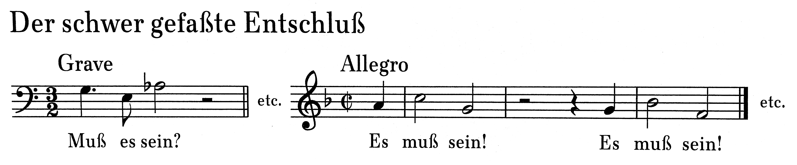
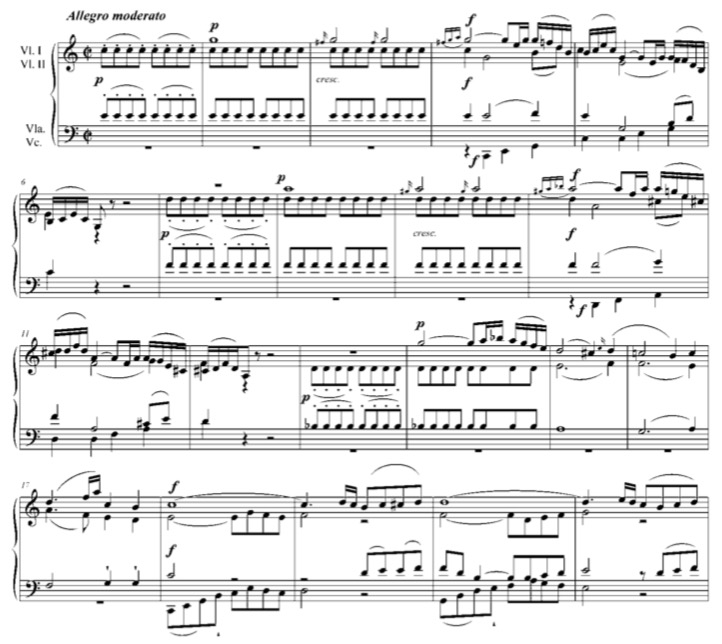

<!--
author:   Dennis Ried
email:    dennis.ried@musikwiss.uni-halle.de
version:  1.0.0
language: de
narrator: Deutsch Female
import:   ../config.md
link:     ../style.css
link:     https://fonts.googleapis.com/css2?family=Source+Sans+3:ital,wght@0,200..900;1,200..900&display=swap
font:     Source Sans 3
tags:     kultur
-->

# Schule | Empfindsamkeit | Streichquartette

## Entwicklungen

- Johann Joachim Quantz (1697–1773)
  
  - Musiktheoretiker, Flötenlehrer Friedrichs des Großen (Friedrich II. von Preußen)
  - Quantz am Ende 18. Jhd.:
  
   - die Deutschen besäßen keinen eigenen Geschmack
   - daher: prädestiniert für einen „vermischten Geschmack“
   - Idee: Synthese des italienischen und französischen Stils
   - Kühne These: wenn die Italiener und Franzosen diesen „deutschen Geschmack“ übernähmen, »so könnte mit der Zeit ein allgemeiner guter Geschmack in der Musik eingeführet werden.«

- um 1760
  
  - deutsche Musiker haben wichtige Positionen in europäischen Musikzentreninne
  - Christoph Willibald Ritter von Gluck führt in seinen Reformopern die italienische und französische Oper zusammen
  - Gluck äußerte 1773, er wolle mit seiner Musik »la ridicule distinction des musiques nationales« (›den lächerlichen Unterschied nationaler Musikstile‹) aufheben.

-  Ende des 18. Jhd.: Haydns Tonspache in ganz Europa verbreitet, wurde überall nachgeahmt

- Norddeutschland

  - Carl Philipp Emanuel Bach als führender Musiker aus einer Gruppe, wegen ihrer Verbindungen zum preußischen Hof Friedrichs des Großen auch Berliner Schule genannt wurde
  - Carl Philipp Emanuel Bach, seit 1768 städtischer Musikdirektor und Kantor in Hamburg – als Nachfolger von Georg Philipp Telemann
  - Die Cembalo-Musik C. P. E. Bachs (etwa 150 Sonaten), steht der Strömung der Empfindsamkeit nahe

## Empfindsamkeit

### Begriff

- Bezeichnung
  
  - Aus der Übersetzung von Lawrence Sterns Roman *A Sentimental Journey Through France and Italy by Mr. Yorick* (1768)
  - Übersetzung von „sentimental“ mit der deutschen Vokabel „empfindsam“
  - Gewisse Feinfühligkeit und Sensibilität, eine Art Gefühlskult (v.a. bürgerliche Kreise in Nord-Dt.)
  - Klaviermusik gibt dieser Strömung reichlich Nahrung

- Verortung:

  - Ältere Auffassung: Empfindsamkeit ist Gegensatz zur rationalen Aufklärung
  - Neuere kulturgeschichtliche Auffassung: Empfindsamkeit kein Gegenkonzept sondern eine Ergänzung zur Aufklärung
  - *Empfindsamkeit* nicht verwechweln mit *Sturm und Drang* (irrational geprägte antiaufklärerischen Phase)

> "So wie Philosophie, oder Wissenschaft überhaupt, die Erkenntniß zum Endzwek hat, so zielen die schönen Künste auf Empfindung ab. [. . .] Eine allgemeine, wol geordnete Empfindsamkeit des Herzens ist [. . .] der allgemeineste Zwek der schönen Künste."
>
> – Johann Georg Sulzer: Artikel "Empfindung", in: *Allgemeine Theorie der schönen Künste*, 1771

- Paradigmenwechsel in der Ästhetik

  - Musik Ende 18. Jhd
    
    - nicht mehr *Quadrivium* der sieben freien Künste
    - Teil der ,schönen Künsten‘
    - Wirkungsfeld: das der ,Empfindsamkeit‘

  - *Carl Philipp Emanuel Bachs Empfindungen*
    
    - Fantasie in fis-Moll (1788) H. 300[^1]("E. E. Helm, Thematic Catalogue of the Works of C. Ph. E. Bach, New Haven/L. 1989.") bzw. Wq. 67[^2]("A. Wotquenne, Thematisches Verz. der Werke von C. Ph. E. Bach, Lpz. 1905")
    - größtenteils keine Taktstriche (Eindruck einer Improvisation)

> „Indem ein Musickus nicht anders rühren kan, er sey dann selbst gerührt; so muß er nothwendig sich selbst in alle Affeckten setzen können, welche er bey seinen Zuhörern erregen will; er giebt ihnen seine Empfindungen zu verstehen und bewegt sie solchergestallt am besten zur Mit-Empfindung.“
>
> – Carl Phillip Emanuel Bach: *Schrift Versuch über die wahre Art, das Clavier zu spielen* (1753, Berlin)

!?["C.P.E. Bach: Fantasie in fis-Moll"](https://www.youtube.com/watch?v=LOT_nUPvE98 "C.P.E. Bach: Fantasie in fis-Moll")

### "Epoche der Empfindsamkeit"

- Mit Übersetzung von Sterns Roman ist der Begriff der Empfindsamkeit im europäischen Diskurs eingeführt
- Was versteht man unter Empfindsamkeit? 
- kaum möglich, das Phänomen in seiner europäischen Dimension Differenzierungen zu erfassen

  - große Diversität
  - Verständnis von Empfindsamkeit (2. Hälfte 18. Jhd.)
  - zweiten Hälfte des 18. Jahrhunderts unter Empfindsamkeit verstanden wurde und das, was nach der
  - Weiterentwicklungen nach 1900 bis in die romantische Ästhetik
  - Auffällig: Starkes Nachdenken über philosophische, ethisch-moralische, physikalische und physiologische Aspekte (auch ästhetische Dimensionen von Empfindungen)

- Frankreich
  
  - *sensibilité* ist nicht an einen bestimmten Stand gebunden
  - *sensibilité* wird zugänglich für 'einfache Leute'
  - grundlegende Veränderung in der Geisteshaltung der Gesellschaft 
  - Kehrseite: Empfindsamkeit = seelische Verletzlichkeit; Jean-Jacques Rousseau: Rückzug in die Natur!

- Charakteristika für Empfindsamkeit
  
  - Betonung des Gefühls und dadurch entstehende Freiräume für Irrationalität
  - bewusste Abkehr von der Aufklärung und der Aristokratie
  - Empfindsamkeit als Rückzug auf naturgegebene und natürliche Empfindungen
  - Natur wird zur wichtigsten Instanz der Empfindsamkeit
  - Auch Versuch der Theoriebildung hin zu einer Empfindungslehre

### Natur

- Natur als Spiegel der menschlichen Seele
  
  - *Gewitterszenen* bei emotionalen Turbulenzen
  - *Wald* als Spiegel einer dunklen, undurchdringlichen Seele

> „Wir traten ans Fenster. Es donnerte abseitwärts, und der herrliche Regen säuselte auf das Land, und der erquickendste Wohlgeruch stieg in aller Fülle einer warmen Luft zu uns auf. Sie stand auf ihren Ellenbogen gestützt, ihr Blick durchdrang die Gegend; sie sah gen Himmel und auf mich, ich sah ihr Auge tränenvoll, sie legte ihre Hand auf die meinige und sagte: ,Klopstock!‘ – Ich erinnerte mich sogleich der herrlichen Ode, die ihr in Gedanken lag, und versank in dem Strome von Empfindungen, den sie in dieser Losung über mich ausgoß. Ich ertrug's nicht, neigte mich auf ihre Hand und küßte sie unter den wonnevollsten Tränen.“
>
> – Wolfgang von Goethe: *Die Leiden des jungen Werther* (1774), "Erstes Buch", Ende der Passage "Am 16. Junius"

- Friedrich Gottlieb-Koppstock (1724–1803)

  - Dichter
  - Signum der Empfindsamkeit
  - Seine Gedichte zitieren / seinen Namen nennen = Outing als *empfindsames Ich*

- Naturbezug der Empfindsamkeit
  
  - zeigt sich in der Musik
  - primärer menschlichen Ausdruck: die Stimme
  - a cappella-Gesang oder Klavierbegleitung
  - Viele Beispiele in den Novellen, Romanen und der Lyrik der Empfindsamkeit

> "Ich weiß nie, wie mir ist, wenn ich bei ihr bin; es ist, als wenn die Seele sich mir in allen Nerven umkehrte. – sie hat eine Melodie, die sie auf dem Klaviere spielet mit der Kraft eines Engels, so simpel und so geistvoll! Es ist ihr Leiblied, und mich stellt es von aller Pein, Verwirrung und Grillen her, wenn sie nur die erste Note davon greift.
> Kein Wort von der Zauberkraft der alten Musik ist mir unwahrscheinlich. Wie mich der einfache Gesang angreift! Und wie sie ihn anzubringen weiß, oft zur Zeit, wo ich mir eine Kugel vor den Kopf schießen möchte! Die Irrung und Finsternis meiner Seele zerstreut sich, und ich atme wieder freier.“
>
> – Goethe: *Werther*, "Erstes Buch" Ende der Passage „Am 16. Julius“

### Melancholie

- wichtige Stimmungslage der Empfindsamkeit
- Aufklärung: leugnet Existenz nicht, kann Melancholie aber auch nicuht rational erklären!
- Empfindsamkeit: Melancholie als Zustand tiefer seelischer Versenkung

  - mit Naturbildern assoziiert:
    
    - dunkle Wälder
    - Mondnächte
    - klagender Gesang einer Nachtigall

  - Nähe zu Todesvorstellungen
    
    - Vgl. elegische Gedichte oder die Lyrik von Friedrich Gottlieb Klopstock

- Warnung vor zu viel Empfindungen
  
  -  Christian Friedrich Michaelis()
  - Leipziger Musikästhetiker und Philosoph
  - „Missbrauch der Blasinstrumente in der neuen Musik“
  - Blasinstrumente: „in ihren Tönen zu viel Reiz, zu viel die bloß sinnliche Empfindung Aufregendes und Ausfüllendes“
  - Vorsicht, wenn man den Zuhörer nicht „erschüttern, verwirren oder betäuben will“

## Mannheimer Schule

- Gründer: Pfälzischer Kurfürsten Karl Theodor 
- Dauer: 1724 bis 1799 (drei Generationen)
- Musiker: europaweit anerkannten Instrumentalvirtuosen, Komponisten und Kapellmeister

> „Es sind wirklich mehr Solospieler und gute Komponisten in diesem, als vielleicht in irgend einem Orchester in Europa. Es ist eine Armee von Generälen, gleich geschickt einen Plan zu einer Schlacht zu entwerfen, als darin zu fechten.“
>
> – Charles Burney, englischer Musikhistoriker 

- Personen
  
  - Brüder Toeschi (Italien), Violinisten und Komponisten
  - Franz Xaver Richter (Böhmen), Komponist, Violinist und Sänger
  - Johann Anton Filtz (Bayern), Violoncello und Komponist
  - Ignaz Jakob Holzbauer (Österreich), Opernkomponist
  - Johann Christian Cannabich (Mannheim)
  - Johann Stamitz (Böhmen), Konzertmeister und Leiter, Violinvirtuose und angesehener Komponist
  
- Aufgaben
  
  - Komponieren
  - Solistentätigkeit
  - Untericht
  - wöchentliche Konzerte

> „Kein Orchester der Welt hat es je in der Ausführung dem Manheimer zuvorgethan. Sein Forte ist ein Donner, sein Crescendo ein Catarakt, sein Diminuendo – ein in die Ferne hin plätschernder Krystallfluss, sein Piano ein Frühlingshauch.“
>
> – Friedrich Daniel Schubart: *Ideen zu einer Ästhetik der Tonkunst*

- Bewunderung von Disziplin, Dynamischer Kontrolle, Ansehen am Hof
- In der dritten Generation endete der Glanz des Orchesters

  - Karl Theodor wird bayerischer Kurfürst
  - Residenz wird nach München verlagert
  - Bedeutung sinkt, später kaum noch Bedeutung

- Die Musik der Mannheimer (verallgemeinert)
  
  - Durchsichtiger Satz
  - Harmonik von der Melodie her konzipiert
  - Vier- oder Acht-Taktgruppen bilden periodische Reihungsformen
  - klangliche und dynamische Kontraste auf kleinstem Raum
  - Figuren nach Hugo Riemann ("Mannheimer Manieren")
    
    -  "Walze", ein allmählich ins Tutti ausgeführtes Cresendo
    - "Rakete", rasch aufsteigende Dreiklangsbrechungen
    - "Vorhang", Akkordschläge zum Beginn eines Satzes
    - etc.

- Nachwirkungen: Orchesterbesetzung der Sinfonie

  - vierstimmigen Streichersatz
  - 4x zwei Holzbläser
  - zwei Hörner
  - zwei Pauken
  - ggf. zwei Trompeten

!?["Johann Stamitz: Sinfonie in D-Dur op. 3,2"](https://www.youtube.com/watch?v=fh8-6mpZAxw "Johann Stamitz: Sinfonie in D-Dur op. 3,2")

## Begriff "Schule"

- **Berliner Schule**
  
  - Gruppe, lokal begrenzt
  - schafft neue Entwicklungen

- **Mannheimer Schule**
  
  - Gruppe, likal begrenzt
  - schafft neue Entwicklungen
  - tradiert diese an die nächste Generation

- ***Wiener Schule ?***
  
  - Gruppe?, lokal begrenzt?
  - schafft neue Entwicklungen!

  - Haydn (1732–1809)

    - Schloss Esterhazy / Wien

  - Mozart (1756–1791)

    - bis 1781 in Salzburg / 1787–1791 in Wien

  - Beethoven (1770–1827)

    - Studienreise nach Wien / ansässig erst nach Mozerts Tod

- Schule vs. Stil

## Streichquartette (Haydn)

### Zur Person

- Franz Joseph Haydn (1732–1809)
- drei musikgeschichtliche Epochen
  
  - Schüler Nicola Porporas (1686–1768)
  - wird Mitbegründer eines klassischen Stils in der Instrumentalmusik
  - erlebte noch die beginnenden Entwicklungen hin zu einer romantischen Musik
  
- Haydn im Dienste der Esterhazys
  
  - 1760 Dienstantritt bei Fürst Paul Anton Esterhazy
  - 1762 Dienstherr: Nikolaus Esterhazy (Bruder)
    
    - baut 1765 ein neues Residenzschloss in Eisenstadt
    - mit integrierten Opernhaus und einem Marionettentheater
  
  - 1790 Dienstherr: Fürst Anton Esterhazy
    
    - Auflösung der Kapelle
    - Haydn wird entlassen, reist nach England
  
  - 1794 Dienstherr #4
    
    - belebt das Musikleben wieder
    - Joseph Haydn (fast 70 Jahre alt!) kommt regelmäßig im Sommer zum Schloss nach Eisenstadt
    - komponiert jedes Jahr eine Messe zur Feier des Namentags der Fürstin

> „Mein Fürst war mit allen meinen Arbeiten zufrieden, ich erhielt Beyfall, ich konnte als Chef eines Orchesters Versuche machen, beobachten, was den Eindruck hervorbringt, und was ihn schwächt, also verbessern, zusetzen, wegschneiden, wagen; ich war von der Welt abgesondert, Niemand in meiner Nähe konnte mich an mir selbst irre machen und quälen, und so mußte ich original werden.“
> 
> – G. A. Griesinger, Biographische Notizen über Joseph Haydn (1810), hg. von F. Grasberger, Wien 1954, S. 17.

- Was ist das Wesentliche an einer künstlerischen Leistung?
- Im Barock: die Ausarbeitung und das handwerkliche Geschick
- In der Klassik: der originelle Einfall

### Streichquartette

- Frühe Streichquartette als Reihungsformen
- 1771 bis 1781 keine Streichquartette komponiert
- 1781 (nach zehn Jahren!): Streichquartette op. 33

  - „auf eine gantz neu Besondere Art“
  - Neu: Prinzip der *thematischen Arbeit*

- Lösung für ein Kernproblem der Klassik:
  
  - künstlerische Einheit bei kontrastreiche und melodisch-harmonische klangliche Vielfalt Reihung von Perioden

- Streichquartette op. 33
  
  - "durchbrochene Arbeit"
  - vier Streichquartetsstimmen sind "frei"
    
    - können in jedem Moment ihre Funktion ändern
    - sind mal Begleitstimme, mal Melodiestimme
    - treten hervor oder pausieren
    - können zu zweit in einen Dialog treten
    - oder zu viert einander motivisch imitieren

  - Satzbild wechselt unablässig vom einstimmigen zum vielstimmigen
  - Motive wandern von einer zur anderen Stimme und werden von allen nacheinander oder gleichzeitig aufgegriffen

> „Man hört vier vernünftige Leute sich unter einander unterhalten, glaubt ihren Discursen etwas abzugewinnen und die Eigentümlichkeiten der Instrumente kennenzulernen.“
>
> – Johann Wolfgang Goethe 1829 in einem Brief an Carl Friedrich Zelter (1758–1832)

---

Beethoven, Streichquartett op. 135
---

---

Haydn op. 33 Nr. 3 (Hob. II:39, „Vogel-Quartett“)
---

!?["Haydn op. 33 Nr. 3, The Zagreb Quartet"](https://www.youtube.com/watch?v=Ae5Udvp8gm8 "Haydn op. 33 Nr. 3, The Zagreb Quartet")